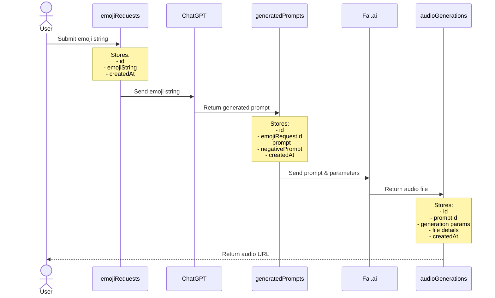

# Emoji Infinite Audio Game

## Description

This is a simple game where you can select multiple emojis and generate a sound from that.

## Tasks

### Completed
- [x] UI layer for selecting emojis to send to the tRPC API route

### In Progress
- [X] Database Schema Design
  - [X] Define types for emoji requests table
  - [X] Define types for text conversions table
  - [X] Define types for audio generations table

### Todo
- [ ] Audio Generation Pipeline
  - [ ] Connect tRPC API route to Fal.ai
  - [ ] Implement audio generation from emoji input
  - [ ] Add error handling and retries
- [ ] Audio Visualization
  - [ ] Add waveform visualization
  - [ ] Add playback controls
- [ ] Storage Implementation
  - [ ] Set up Supabase storage
  - [ ] Implement audio file upload/retrieval
  - [ ] Add caching layer

## Flow

